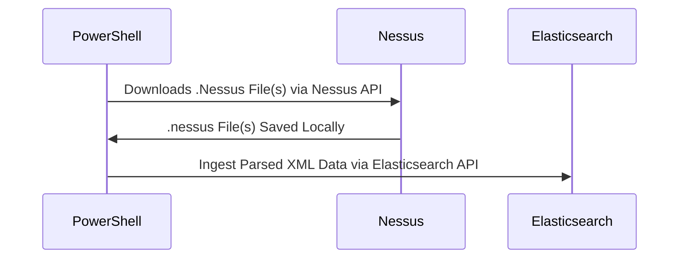

# Nessus-ES

Ingest .nessus files from Tenable's Nessus scanner directly into ElasticSearch with most of the ECS mappings.

With some careful setup of your Elastic stack and a little PowerShell you can turn your .nessus files into this:

If you are looking for a more robust solution that handles many other vulnerability scanners try this project: https://github.com/HASecuritySolutions/VulnWhisperer

The Nessus-ES project is a simplified way of taking .nessus files and ingesting them into Elastic using PowerShell on Windows, Mac, or Linux

Requirements
* Functioning ElasticSearch Cluster (7.0+, 7.16.2 Tested, 8.10.4 Recommended)
* PowerShell 7.0+
* .nessus File(s) Exported (Script included to export .nessus files!)

## Now
- [X] Index Template (How To)
- [X] Index Pattern, Searches, Visualizations, and Dashboards
- [X] ECS coverage across as many fields as possible
- [X] Documentation ([Wiki](https://github.com/nicpenning/Nessus-ES/wiki))
- [X] Automated Nessus File Download Script
- [X] Automated Ingest
- [X] Create a release

## Future
- [ ] Migrate to Data Stream (logs-*)
- [ ] Cleanup unnecessary mappings
- [ ] Migrate most enrichments to Ingest Pipelines
- [ ] Add Detection Rules
- [ ] Add Setup Script (Template, Objects, API, etc..)
- [ ] Upgrade to latest ECS
- [ ] Revamp Dashboards to use Lens Visuals

## Automated Download and Ingest capability - Check the [Wiki](https://github.com/nicpenning/Nessus-ES/wiki)!
ExtractFrom-Nessus.ps1 -> Automate-NessusImport.ps1 -> ImportTo-Elasticsearch-Nessus.ps1

Here are some other details from the dashboard not pictured above that could also be useful:

## VPR Search in Dashboard

