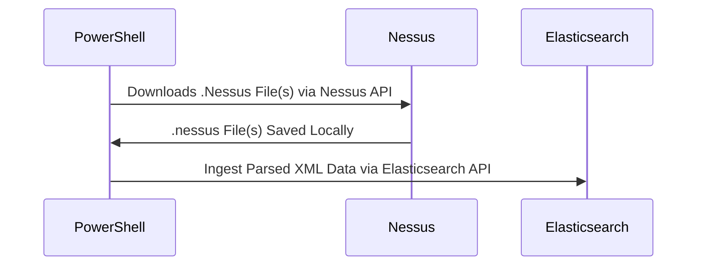

# Nessus-ES

Ingest .nessus files from Tenable's Nessus scanner directly into ElasticSearch with most of the ECS mappings.

With some careful setup of your Elastic stack and a little PowerShell you can turn your .nessus files into this:

If you are looking for a more robust solution that handles many other vulnerability scanners try this project: https://github.com/HASecuritySolutions/VulnWhisperer

The Nessus-ES project is a simplified way of taking .nessus files and ingesting them into Elastic using PowerShell on Windows, Mac, or Linux.

Requirements
* Functioning Elastic Stack (7.0+, 8.10.4 Tested)
* PowerShell 7.0+
* .nessus File(s) Exported (Script included to export these files!)

## Now
- [X] Index Template (How To)
- [X] Index Pattern, Searches, Visualizations, and Dashboards
- [X] ECS coverage across as many fields as possible
- [X] Documentation ([Wiki](https://github.com/nicpenning/Nessus-ES/wiki))
- [X] Automated Nessus File Download Script
- [X] Automated Ingest
- [X] Create a release

## Future
- [ ] Add Detection Rules
- [ ] Add Setup Script (Template, Objects, API, etc..)

## Automated Download and Ingest capability - Check the [Wiki](https://github.com/nicpenning/Nessus-ES/wiki)!
ExtractFrom-Nessus.ps1 -> Automate-NessusImport.ps1 -> ImportTo-Elasticsearch-Nessus.ps1

## Full dashboard preview
https://github.com/nicpenning/Nessus-ES/assets/5582679/448505f5-7991-4554-b199-412dd5351329

