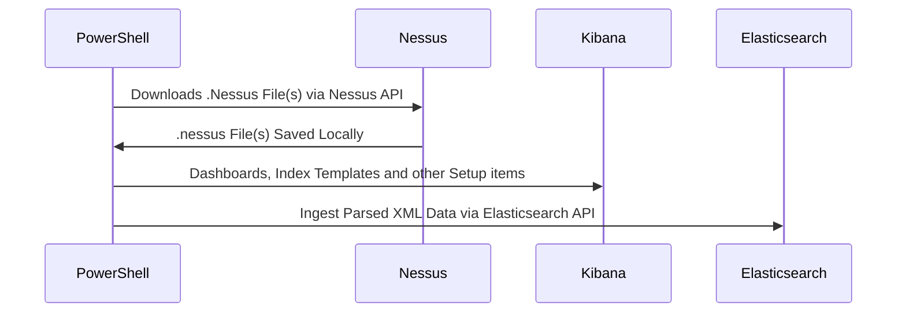

# Nessus-ES

Ingest .nessus files from Tenable's Nessus scanner directly into ElasticSearch with most of the ECS mappings.

With some careful setup of your Elastic stack and a little PowerShell you can turn your .nessus files into this:

If you are looking for a more robust solution that handles many other vulnerability scanners try this project: https://github.com/HASecuritySolutions/VulnWhisperer

The Nessus-ES project is a simplified way of taking .nessus files and ingesting them into Elastic using PowerShell on Windows, Mac, or Linux.

Requirements
* Functioning Elastic Stack (7.0+, 8.11.0 Tested)
* PowerShell 7.0+ (7.3.8 Tested)
* .nessus File(s) Exported (Script included to export these files!)

Script now includes a Menu to help you through the process to use this tool:

## Now
- [X] Index Template (How To)
- [X] Index Pattern, Searches, Visualizations, and Dashboards
- [X] ECS coverage across as many fields as possible
- [X] Documentation ([Wiki](https://github.com/nicpenning/Nessus-ES/wiki/Overview))
- [X] Automated Nessus File Download Script
- [X] Automated Ingest
- [X] Create a release
- [X] Add Setup Script (Template, Objects, API, etc..)

## Future
- [ ] Add Detection Rules

## Automated or Manual Download and Ingest capability - Check the [Wiki](https://github.com/nicpenning/Nessus-ES/wiki/Overview)!
Invoke-NessusTo-Elastic.ps1

## Full dashboard preview
https://github.com/nicpenning/Nessus-ES/assets/5582679/448505f5-7991-4554-b199-412dd5351329

